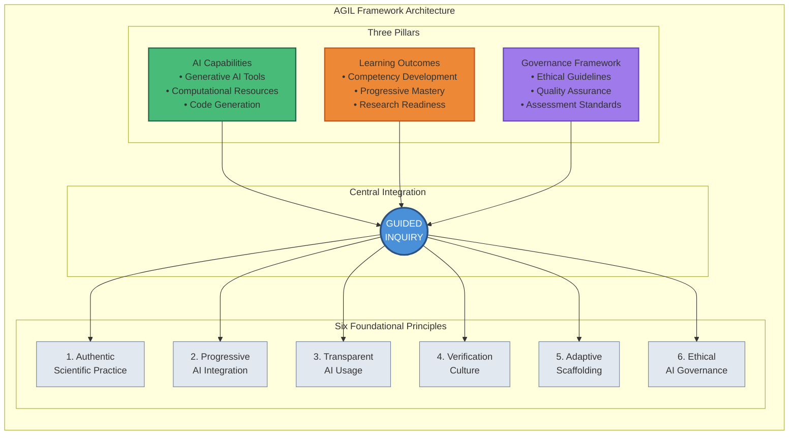
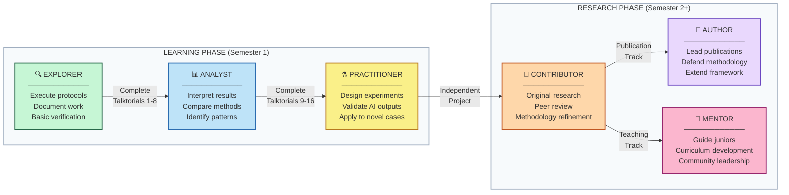
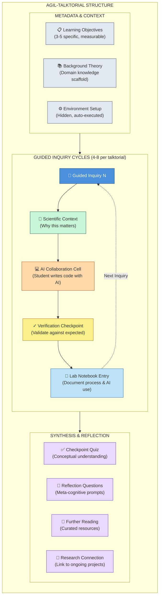
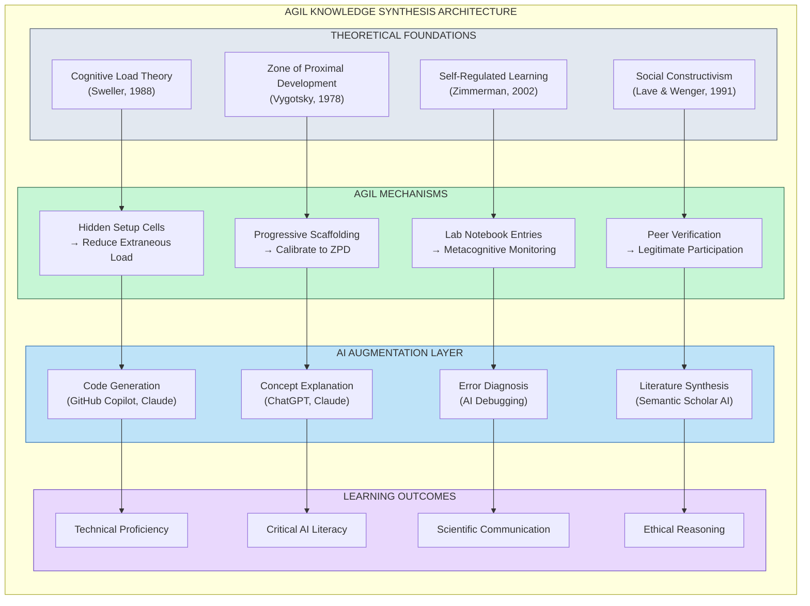

# Theoretical Framework

*AI-Guided Inquiry Learning (AGIL): A Pedagogical Synthesis for Computational Drug Discovery Education*

---

**Dayanjan S. Wijesinghe, Ph.D.**

Associate Professor
Department of Pharmacotherapy and Outcomes Sciences
Virginia Commonwealth University School of Pharmacy
Richmond, Virginia, USA

*Correspondence*: wijesingheds@vcu.edu

ORCID: 0000-0002-2124-5109

---

## Abstract

The integration of artificial intelligence into pharmaceutical sciences creates both educational opportunities and pedagogical challenges. Tools such as AlphaFold, ESM-1v, and neural network-enhanced docking algorithms have democratised computational approaches previously accessible only to specialists, yet frameworks for teaching students to use these tools critically remain underdeveloped. This manuscript presents AI-Guided Inquiry Learning (AGIL), a pedagogical framework synthesising Process Oriented Guided Inquiry Learning (POGIL), Just-in-Time Teaching (JiTT), and flipped classroom methodology while introducing AI as an active learning partner requiring systematic verification against primary sources. AGIL addresses both student learning and instructor scalability: AI serves as a teaching partner for faculty, automating the feedback loops that make approaches like POGIL and JiTT effective but traditionally unsustainable. The framework's five defining characteristics—AI as inquiry partner, verification as core learning outcome, three-exposure learning cycle, documented AI interaction, and AI as teaching partner—position students to develop both domain expertise and transferable meta-skills. AGIL is instantiated in a 14-week computational drug discovery curriculum featuring 20 guided inquiry notebooks across a six-target therapeutic portfolio, with empirical evaluation planned for Spring 2026.

**Keywords**: AI-guided inquiry learning, AGIL, POGIL, JiTT, computational drug discovery, pharmaceutical education, AI literacy

**Data and Code Availability**: All curriculum materials, talktorials, and documentation are available at: https://github.com/dayanjan/AGIL-VIP-AI-PSCI-Public

---

## 1. Introduction: The Pedagogical Imperative

The integration of artificial intelligence into pharmaceutical sciences has created both an unprecedented opportunity and a pedagogical challenge. Tools such as AlphaFold, ESM-1v, and molecular docking algorithms have democratised computational approaches that were previously accessible only to specialists with extensive training (Jumper et al., 2021; Lin et al., 2023). Yet the educational frameworks needed to prepare students—particularly those without traditional prerequisites in biochemistry or computational biology—have not kept pace with these technological advances (Kasneci et al., 2023).

This theoretical framework presents AI-Guided Inquiry Learning (AGIL), a novel pedagogical approach that synthesises three established educational paradigms—Process Oriented Guided Inquiry Learning (POGIL), Just-in-Time Teaching (JiTT), and flipped classroom methodology—while introducing a distinctive element: AI as an active learning partner requiring critical verification. AGIL addresses the fundamental question: How do we teach students not merely to *use* AI tools, but to *learn with* them in ways that develop both domain expertise and critical evaluation skills?

A secondary but equally important challenge accompanies this pedagogical question: scalability. The most effective approaches to science education—POGIL, JiTT, and similar active learning methods—share a common limitation: they demand substantial instructor time (Eberlein et al., 2008). POGIL requires facilitating small-group activities; JiTT requires reviewing student responses before each class session to adapt instruction. These time demands, while pedagogically justified, create a scalability barrier that prevents widespread adoption—particularly for individual faculty without teaching assistants or course release time.

AGIL addresses both challenges simultaneously. The dual partnership is central. For students, AI serves as an inquiry partner, enabling exploration of complex concepts while developing critical verification skills. For faculty, AI serves as a teaching partner, automating progress monitoring, identifying struggling students, and analysing student work at scale—transforming the traditionally manual JiTT feedback loop into a sustainable practice (Black & Wiliam, 1998). AI supporting both learning and teaching distinguishes AGIL from frameworks that address only one side of the educational equation.

AGIL emerges from a recognition that current approaches to AI in education fall into one of two problematic categories: they either treat AI as a tool to be studied about (AI literacy frameworks that lack disciplinary grounding) or as a productivity aid to be used uncritically (AI-enhanced learning that fails to develop verification skills). AGIL occupies a distinct third position: AI as an inquiry partner that requires—and thereby teaches—critical evaluation. Framing AI as an inquiry partner addresses concerns about AI generating plausible but inaccurate information (Ji et al., 2023; Bender et al., 2021).

### 1.1 Institutional Context: Vertically Integrated Projects

AGIL was developed within the context of a Vertically Integrated Projects (VIP) course at Virginia Commonwealth University: "AI in Pharmaceutical Sciences: Bench to Bedside." Understanding the VIP framework is essential for appreciating both AGIL's design constraints and its potential for broader adoption.

**The VIP Model**

Vertically Integrated Projects is an educational model developed at Purdue University in 2001 and refined at Georgia Tech since 2009 (VIP Consortium, 2024). Now implemented at over 50 institutions worldwide through the VIP Consortium, the model embeds multidisciplinary undergraduate teams in long-term faculty research projects. Unlike traditional undergraduate research—which typically involves one-on-one mentoring for a single semester—VIP can scale to large, vertically integrated teams where students at different academic levels work together on ambitious, multi-semester projects.

The VIP model addresses several persistent challenges in undergraduate STEM education: scalability of high-impact practices (Kuh, 2008), peer mentoring and knowledge continuity, research integration, and equity in access. Evidence from the VIP Consortium demonstrates measurable outcomes: VIP participants show triple the odds of job placement prior to graduation compared to non-participants, along with significant gains in leadership and professional skills.

**AGIL Within the VIP Framework**

AGIL leverages VIP's unique affordances—multi-semester progression, vertical integration, faculty research embedding, and scalable mentoring—while addressing the specific challenge of introducing AI-native drug discovery tools to undergraduate students. The AI in Pharmaceutical Sciences VIP follows a two-phase structure: Phase 1 (Spring 2026) uses the complete AGIL curriculum to build foundational competencies, while Phase 2 (Fall 2026 and beyond) transitions students to open-ended research with novel targets, independent research questions, and mentoring responsibilities. The two-phase structure mirrors VIP's fundamental insight that sustained engagement over multiple semesters allows depth impossible in traditional course structures.

A primary challenge for faculty running a VIP is getting the students up to speed with the theoretical knowledge required for subsequent research undertaking under the faculty member's guidance. Within our VIP, AI in Pharmaceutical Sciences, students typically enrol in consecutive semesters, progressing from structured curriculum (Phase 1) to open-ended research with publication/presentation (Phase 2). Traditional approaches require substantial instructor time for foundational instruction during Phase 1—time that competes with research mentoring, publication coaching, and presentation skills development. AGIL addresses this by offloading foundational knowledge acquisition to the AI-assisted curriculum, ensuring students reach research-readiness efficiently while preserving faculty time for the mentoring activities that define high-quality undergraduate research experiences (Lopatto, 2010).

**Curriculum Agility for Rapidly Evolving Fields**

The VIP model offers a critical advantage for fields experiencing rapid technological evolution, such as AI-driven drug discovery. Traditional didactic courses require curriculum committee approval cycles spanning one to two years; by the time a textbook chapter on AlphaFold2 is written, AlphaFold3 has been released. VIP courses, operating more like research labs than fixed curricula, can adapt content semester-to-semester at instructor discretion. Multi-semester student engagement compounds this advantage: students who learned one generation of tools can learn the next and mentor newer students on both, creating living knowledge transfer rather than static content delivery. Advanced students can contribute new talktorials for emerging tools, scaling content creation beyond instructor capacity. Curriculum agility—the ability to incorporate new tools, update workflows, and retire outdated approaches within a single semester—positions VIP as a uniquely suitable vehicle for education in rapidly evolving AI-native domains.

Meeting this educational imperative requires building upon proven pedagogical foundations. Before presenting AGIL's innovations, we situate the framework within the established approaches it synthesises.

---

## 2. Historical Foundations

AGIL synthesises three established pedagogical approaches, each contributing essential elements while AGIL addresses their individual limitations.

### 2.1 Process Oriented Guided Inquiry Learning (POGIL)

POGIL (Moog & Spencer, 2008) uses carefully sequenced activities that lead students to discover concepts through exploration rather than exposition. Three principles define the approach: guided inquiry (discovery through structured exploration), process skills development (teamwork, communication, critical thinking), and structured group roles (creating accountability). These principles align with broader frameworks for scientific inquiry in education (National Research Council, 2000). Meta-analyses confirm POGIL's effectiveness, with particular benefits for underrepresented students (Eberlein et al., 2008; Walker & Warfa, 2017).

*AGIL's inheritance*: The guided inquiry structure, drawing on the scaffolding concept that structured support helps learners accomplish tasks beyond their independent capability (Wood, Bruner & Ross, 1976). However, AGIL substitutes AI for the traditional human facilitator in the initial exploration phase, while preserving human guidance in synthesis and verification.

### 2.2 Just-in-Time Teaching (JiTT)

JiTT (Novak et al., 1999) creates a feedback loop: students complete pre-class "warmups," which instructors review to identify misconceptions and adapt instruction accordingly. This responsive approach has demonstrated significant learning gains—studies report 52.3% learning gains versus 16.7% in traditional courses (Simkins & Maier, 2010). JiTT's metacognitive prompts ("What is still unclear?") encourage self-monitoring, a key component of metacognitive skill development (Schraw & Moshman, 1995).

*AGIL's inheritance*: The feedback loop between pre-class exploration and in-class synthesis, consistent with formative assessment principles (Black & Wiliam, 1998). However, traditional JiTT requires manual review—limiting scalability. AGIL addresses this through automation: AI-powered analysis of student lab notebooks creates a scalable version of the JiTT feedback loop.

### 2.3 Flipped Classroom Methodology

The flipped classroom (Bergmann & Sams, 2012) inverts traditional instruction: content engagement occurs before class, freeing face-to-face time for active learning. Meta-analyses show modest but consistent improvements (Freeman et al., 2014; O'Flaherty & Phillips, 2015). However, the flipped model alone does not specify what students should do before class—it merely inverts timing.

*AGIL's inheritance*: The pre-class content structure. However, AGIL goes beyond passive consumption (watching videos) to active exploration (AI-guided inquiry), addressing a key limitation of basic flipped implementations. The shift from passive to active engagement leverages retrieval practice effects that strengthen long-term retention (Bjork & Bjork, 2011).

While these pedagogical foundations are well-established, their application to AI-assisted learning in computational sciences remains underdeveloped. We now examine how current approaches to AI in education fall short of addressing the specific challenges facing pharmaceutical sciences education.

---

## 3. Gap Analysis: Current Approaches to AI in Education

### 3.1 AI Literacy Frameworks

The rapid adoption of generative AI tools in education has prompted extensive development of AI literacy frameworks. Notable examples include the UNESCO AI competency frameworks for students and teachers (2024), which emphasise human-centred approaches to AI literacy, and various institutional frameworks addressing technical, evaluative, practical, and ethical dimensions.

These frameworks provide valuable taxonomies of what students should understand about AI. However, they share a critical limitation: they identify *competencies* without specifying *pedagogies*. Knowing that students should be able to "critically evaluate AI outputs" does not tell an instructor how to teach this skill in the context of pharmaceutical drug discovery versus creative writing versus legal research. The domain-specificity of effective AI verification—understanding what constitutes a primary source, what types of errors AI makes in a particular field, what claims require verification—means that generic frameworks, while necessary, are not sufficient (Frank et al., 2010).

Research on AI literacy instruction has revealed that even after training, many students remain uncertain about how to critically evaluate generative AI outputs (Ng et al., 2021). Such uncertainty points to the need for continued support and explicit teaching of verification methods—precisely what AGIL provides.

### 3.2 AI-Enhanced Guided Inquiry: Emerging but Limited

Several recent studies have explored combining AI with guided inquiry approaches. AI chatbot-supported guided discovery learning has been applied in environmental education (2024), using ChatGPT integrated with the ARCS motivational model for primary education students. "Inquirybot" (2023) implemented a custom chatbot to guide scientific inquiry design for elementary science with K-6 gifted students. Other researchers have explored ChatGPT as a facilitator in inquiry-based learning for primary science education (2024) and dilemma-based learning with ChatGPT in healthcare management education (2025).

These studies demonstrate interest in AI-guided inquiry but reveal important gaps. First, implementations concentrate in K-12 or general higher education contexts rather than advanced STEM disciplines. Second, they typically use general-purpose chatbots (ChatGPT) rather than domain-specific AI tools (AlphaFold, ESM, docking algorithms). Third, and most critically, they do not integrate verification as a core learning outcome—students use AI but receive no systematic training to evaluate AI claims against primary sources. This omission is concerning given well-documented issues with AI-generated content, including hallucination and plausible but inaccurate outputs (Ji et al., 2023; Bender et al., 2021). Fourth, these approaches focus exclusively on *student* use of AI, ignoring the *instructor* scalability challenge. Guided inquiry approaches like POGIL demand substantial facilitator time; AI-enhanced versions do not address how instructors can sustain these pedagogically intensive methods without proportional increases in workload. The question of how AI might support instructors—not just students—remains largely unexamined.

### 3.3 Computational Drug Discovery Education: The TeachOpenCADD Foundation

Existing programmes in computational drug discovery education take primarily didactic approaches. The UCSF AI for Computational Drug Design (AICD3) Master's programme offers a 1.5-year graduate curriculum combining didactic instruction with capstone projects. The NPTEL AI in Drug Discovery course (IIT-BHU) provides 12 weeks of instructor-led content with hands-on tutorials. Commercial offerings such as Insilico Medicine School provide lecture-based instruction with case studies. Coursera and similar platforms offer self-paced online courses focused on content delivery rather than inquiry-based learning.

**TeachOpenCADD: The Foundational Platform**

The most significant pedagogical precedent for AGIL—and a direct intellectual ancestor—is the TeachOpenCADD platform developed by Andrea Volkamer's research group at Charité–Universitätsmedizin Berlin (Sydow et al., 2019, 2022). TeachOpenCADD represents a landmark contribution to open-source computational drug discovery education, and AGIL builds directly upon its innovations.

TeachOpenCADD introduced the "talktorial" format—a term coined by the Volkamer group combining "talk" and "tutorial"—which integrates theoretical background with practical code in Jupyter notebooks. The talktorial format, which AGIL adopts throughout, represents a fundamental pedagogical innovation: rather than separating theory from practice, each notebook weaves explanation and implementation together, allowing students to understand *why* before they learn *how*.

Key contributions from TeachOpenCADD that AGIL inherits include:

- **The talktorial format itself**: Jupyter notebooks combining markdown exposition with executable code
- **Open-source philosophy**: All materials freely available, following FAIR (Findable, Accessible, Interoperable, Reusable) principles (Wilkinson et al., 2016)
- **Progressive skill building**: Topics sequenced to build upon each other, consistent with mastery learning principles (Bloom, 1968)
- **Use of public databases**: ChEMBL, PDB (Protein Data Bank), UniProt as primary data sources
- **RDKit as foundational cheminformatics library**: Molecular representations, fingerprints, descriptors

Several AGIL talktorials directly build upon TeachOpenCADD content:

| AGIL Talktorial | TeachOpenCADD Reference | Relationship |
|-----------------|------------------------|--------------|
| AI-PSCI-005: ChEMBL Data Acquisition | T001: Compound data acquisition | Direct adaptation with 6-target portfolio |
| AI-PSCI-006: ADMET Filtering | T002: ADMET & drug-likeness | Extended with AI-assisted exploration |
| AI-PSCI-007: Molecular Fingerprints | T004-T005: Ligand-based screening | Core concepts with inquiry framing |
| AI-PSCI-008: Clustering & Visualisation | T006: Compound clustering | Adapted for guided inquiry |
| AI-PSCI-015: Molecular Docking | T014-T015: Protein-ligand docking | Foundation with AI verification layer |

**AGIL's Extensions Beyond TeachOpenCADD**

While deeply indebted to TeachOpenCADD, AGIL extends the platform in several directions:

1. **Pedagogical model**: TeachOpenCADD uses a self-study tutorial model where students execute pre-written code; AGIL uses AI-guided inquiry where students write code with AI assistance and verify outputs, representing different levels of inquiry openness (Banchi & Bell, 2008).

2. **AI as learning partner**: TeachOpenCADD treats AI tools as subjects to learn about; AGIL treats AI as an active collaborator in the learning process, requiring students to engage critically with AI-generated content.

3. **AI-native tools**: TeachOpenCADD focuses on established cheminformatics tools (RDKit, PyMol, AutoDock); AGIL extends coverage to AI-native tools transforming drug discovery (AlphaFold2, ESMFold, ESM-1v, DiffDock, GNINA).

4. **Verification as explicit outcome**: TeachOpenCADD includes implicit verification through references and expected outputs; AGIL makes verification an explicit, documented meta-skill with required AI Verification Logs.

5. **Empty code cells**: TeachOpenCADD delivers complete, runnable code; AGIL presents empty cells requiring student implementation, shifting cognitive engagement from comprehension to generation.

AGIL should thus be understood not as a replacement for TeachOpenCADD, but as an extension that applies inquiry-based pedagogy and AI partnership to the foundation that TeachOpenCADD established. Instructors seeking traditional tutorial-style instruction should consider TeachOpenCADD directly; those seeking to develop AI collaboration and verification skills may find AGIL's approach complementary.

### 3.4 AlphaFold in Education: Tutorial-Based, Not Inquiry-Based

Incorporating AlphaFold in teaching requires special attention because fundamental understanding of machine learning (ML) is not trivial, and the physicochemical principles of protein folding must be harmonised with interpretable ML, which is presently unavailable (Outeiral et al., 2022). Current approaches—such as EMBL-EBI's tutorials aimed at researchers or undergraduate biochemistry modules delivering AlphaFold content through demonstration sessions—address this challenge through explanation rather than exploration.

No existing approach uses guided inquiry to let students discover AlphaFold's capabilities and limitations through structured exploration with AI assistance. The absence of such approaches is particularly significant given that understanding AI limitations is essential for safe and effective use in pharmaceutical applications.

### 3.5 Experiential Foundations

The AGIL framework draws on several years of iterative development in AI-assisted pharmacy education. This includes deployment of PharmTutorAI.com, a conversational AI platform used by over 1,200 pharmacy students across 37 countries for patient counseling practice, as well as curriculum development for a Digital Health concentration within a PharmD program. Empirical studies comparing AI-generated feedback to faculty grading (Pham et al., 2025), student experiences with AI-assisted pharmacogenetic counseling (Basalelah et al., 2025), and practical toolkits for building AI patient simulations (Malhotra et al., 2025) have informed the pedagogical design choices described here. The framework's emphasis on AI as inquiry partner emerged directly from mentoring the inaugural cohort of the Vertically Integrated Project in AI for Pharmaceutical Sciences, where an undergraduate student with no prior computational biology training developed a fully automated pipeline integrating AlphaFold2 structure prediction, ESM-1v evolutionary scoring, and molecular docking for drug target variant prioritization—work that would traditionally require graduate-level expertise in structural bioinformatics.

Addressing these gaps requires more than incremental curriculum updates; it demands a fundamental reconceptualisation of how pharmaceutical scientists learn to work with AI systems. We present AI-Guided Inquiry Learning (AGIL) as a response to this challenge—a framework that synthesises proven pedagogical approaches while introducing innovations specific to AI-partnered learning.

---

## 4. The AGIL Framework: A Pedagogical Synthesis

### 4.1 Defining Characteristics

AGIL (AI-Guided Inquiry Learning) synthesises elements from POGIL, JiTT, and flipped classroom methodology while introducing distinctive innovations. The framework rests on a central premise: AI can serve as an effective inquiry partner for initial exploration, provided students receive systematic training to verify AI claims against primary sources and to document both their AI interactions and their verification processes.

Five defining characteristics distinguish AGIL. They are cumulative. Each builds on the others.

1. **AI as Inquiry Partner:** Rather than receiving pre-packaged content or working through instructor-designed discovery activities, students use AI tools to explore guided inquiry questions. The AI provides information, explanations, and perspectives that students must then evaluate critically. The AI partnership model leverages scaffolding principles where temporary support allows learners to achieve goals beyond their independent capability (Wood, Bruner & Ross, 1976).

2. **Verification as Core Learning Outcome:** Every major AI-generated claim must be verified against primary sources (peer-reviewed literature, official databases, regulatory documents). Students maintain AI Verification Logs documenting the claim, the primary source consulted, and the verification status (Confirmed / Partially Confirmed / Contradicted / Unable to Verify). Systematic verification addresses the well-documented phenomenon of AI hallucination—the generation of plausible but factually incorrect content (Ji et al., 2023).

3. **Three-Exposure Learning Cycle:** Each topic is addressed through a spaced repetition cycle with three exposures, leveraging the spacing effect for enhanced retention (Bjork & Bjork, 2011). In the Inquiry Phase (Friday–Sunday), students explore guided inquiry questions using AI tools, documenting their process in lab notebooks. In the Implementation Phase (Sunday–Thursday), students work through hands-on talktorials applying the concepts—this is self-directed work where students implement solutions with AI assistance before class. In the Synthesis Phase (Thursday), class time focuses on discussion, misconception correction, and peer teaching rather than hands-on coding. Separating phases leverages retrieval practice: when students encounter talktorials, they must recall concepts from inquiry rather than simply re-reading.

4. **Documented AI Interaction:** Students record their AI prompts, the responses received, their iterative questioning strategies, conflicting information between AI tools, and their verification processes. These records serve both as evidence of learning and as a resource for developing prompt engineering skills.

5. **AI as Teaching Partner:** While students use AI as an inquiry partner, faculty use AI as a teaching partner. Automation systems analyse student lab notebooks using Claude API (or other LLM APIs), identifying struggling students, detecting common misconceptions, and surfacing patterns across the cohort. Automation transforms JiTT's traditionally manual feedback loop—which requires instructors to read every student response before each class—into a sustainable, scalable practice consistent with formative assessment principles (Black & Wiliam, 1998). The AI does not replace instructor judgement but augments it: faculty review AI-generated summaries and act on flagged concerns rather than manually scanning dozens of documents. Importantly, when the class discusses these AI-generated findings, students have the opportunity to challenge the summaries and defend their approaches—thereby developing the critical skill of evaluating and responding to AI-driven assessments, an increasingly valuable competency in professional contexts. Dual AI partnership—supporting both student inquiry and instructor responsiveness—makes pedagogically intensive approaches like POGIL and JiTT scalable beyond their traditional limits.

### 4.2 The AGIL Innovation Stack

AGIL's contribution lies in its layered integration of multiple innovations. Layers build on layers. Each innovation depends on those below:

**Layer 1 - Accessibility Infrastructure:** Google Colab provides free, browser-based access to computational resources including GPU acceleration—eliminating the need for expensive software licences or institutional high-performance computing infrastructure. Automation systems handle routine administrative tasks: material distribution, progress tracking, and AI-powered analysis of student work. The accessibility layer serves two goals. First, it democratises *student* access: learners can run AlphaFold predictions and molecular docking without specialised hardware. Second, it democratises *faculty* access: instructors can implement pedagogically intensive approaches without unsustainable time investments. No student prerequisites are required beyond basic Python familiarity; no instructor prerequisites are required beyond familiarity with Google Workspace tools.

**Layer 2 - Pedagogical Synthesis:** POGIL's guided inquiry structure combines with JiTT's adaptive feedback loop and flipped classroom's pre-class content delivery. Each framework contributes proven elements while AGIL addresses their individual limitations.

**Layer 3 - AI-Native Tools:** Rather than teaching about traditional cheminformatics tools supplemented by AI, AGIL focuses on the AI tools transforming drug discovery: AlphaFold2 for structure prediction, ESM-1v for evolutionary scoring, DiffDock and GNINA for molecular docking. Students learn with the tools that will define pharmaceutical research of the new age of AI-driven drug discovery. As new AI tools become available for drug discovery the combination of AGIL and VIP models allow seamless integration of learning how to use these new tools into the curriculum with minimal lag times.

**Layer 4 - Domain Application:** The framework is grounded in pharmaceutical sciences with a multi-target portfolio spanning diverse therapeutic areas. Students learn foundational concepts (Weeks 1-4) in a target-agnostic way, then select ONE target from a portfolio of six therapeutically diverse drug targets at Week 5: DHFR (antibiotic resistance), ABL1 (chronic myeloid leukaemia), EGFR (non-small cell lung cancer), AChE (Alzheimer's disease), COX-2 (inflammation), and DPP-4 (diabetes). From Week 5 onward, all subsequent work uses the student's chosen target, allowing personalised learning trajectories while maintaining methodological consistency across the cohort. The target selection model connects abstract AI concepts to tangible pharmaceutical challenges while exposing students to the breadth of drug discovery applications.

**Layer 5 - Meta-Skill Focus:** The ultimate learning outcome is not merely content knowledge or tool proficiency but "learning with AI" as a transferable meta-skill (meta-competence, defined as the ability to learn new skills effectively—knowing how to learn, when to seek help, and how to evaluate one's own understanding). Students learn to use AI for exploration, to verify AI claims, to document AI interactions, and to recognise AI limitations—skills that will remain valuable regardless of which specific AI tools dominate in future years. Focusing on transferable skills aligns with competency-based education frameworks (Frank et al., 2010).

### 4.3 Comparison with Foundational Approaches

AGIL extends each foundational approach. Limitations become opportunities. Each inheritance comes with improvements:

*From POGIL:* AGIL adopts structured inquiry and process skill development. However, where POGIL uses instructor-designed activities completed in class, AGIL uses AI-guided exploration completed before class. Moving exploration outside class time allows AGIL to scale guided inquiry beyond what is possible with limited instructor time while preserving the constructivist principle that students learn best through discovery (National Research Council, 2000).

*From JiTT:* AGIL adopts the feedback loop between pre-class work and in-class instruction. However, where JiTT requires instructors to manually review warmup responses before each class session, AGIL uses AI-powered analysis to identify patterns and concerns. Automated analysis makes the JiTT feedback loop sustainable for instructors managing multiple students across multiple weeks while maintaining the responsiveness that makes JiTT effective (Novak et al., 1999).

*From Flipped Classroom:* AGIL adopts pre-class content engagement. However, where flipped classroom typically uses passive content consumption (watching videos), AGIL uses active exploration (AI-guided inquiry). Active inquiry transforms students from consumers of pre-packaged content to investigators constructing their own understanding—with AI as a resource rather than an authority.

### 4.4 Human Collaboration in an AI-Partnered Framework

A potential concern with AI-partnered learning is the displacement of peer collaboration—a cornerstone of POGIL's effectiveness. AGIL addresses this by distinguishing between the *individual phases* (inquiry and implementation, both self-directed) and the *synthesis phase* (collaborative class discussion).

**Individual AI Inquiry (Pre-Class)**

Students explore guided inquiry questions with AI assistance individually. Individual exploration is intentional: it creates a judgement-free space where students can ask foundational questions, pursue iterative lines of inquiry ("why does this work? but what if...?"), and admit uncertainty without social risk. Unlike group settings where students may hesitate to reveal gaps in understanding, AI partnership allows uninhibited intellectual exploration—the kind of deep, recursive questioning that builds genuine comprehension. This develops personal prompt engineering skills and surfaces AI limitations firsthand rather than relying on a peer's summary. The lab notebook documentation requirement creates individual accountability while preserving a record of the student's authentic learning journey. Critically, the documented trail supports retrospective reflection—students can revisit their thinking to identify where their reasoning was accurate, where misconceptions led them astray, and how AI guidance shaped (or occasionally misguided) their understanding. This metacognitive practice transforms the notebook from mere documentation into a tool for learning how one learns (Schraw & Moshman, 1995).

**Individual Implementation (Pre-Class)**

Students also complete talktorials individually before class. Self-directed implementation reinforces the judgement-free exploration: students can make mistakes, debug with AI assistance, and iterate without time pressure or peer observation. The spacing between inquiry (Friday–Sunday) and implementation (Sunday–Thursday) creates retrieval practice opportunities—students must recall concepts rather than simply re-read them, leveraging desirable difficulties that enhance long-term retention (Bjork & Bjork, 2011).

**Peer Collaboration (In-Class Synthesis Phase)**

Human collaboration intensifies during Thursday's synthesis phase, when students arrive having completed both inquiry and implementation:

- **Verification Log Comparison**: Students compare their AI Verification Logs, discovering that peers may have found different—sometimes contradictory—information from AI tools. Comparing logs surfaces the non-deterministic nature of AI responses and reinforces the importance of verification.

- **Implementation Comparison**: Having completed talktorials independently, students compare approaches, discuss where they struggled, and share solutions. Unlike real-time pair programming, this retrospective comparison allows students to articulate their reasoning about completed work.

- **Cross-Target Discussion**: Because students select different targets from the six-target portfolio, in-class discussion reveals how the same methodology applies across therapeutic areas. A student studying EGFR mutations learns from a peer's DHFR analysis, developing transferable understanding rather than target-specific memorisation.

- **Peer Mentoring (Multi-Semester)**: VIP's vertical integration allows experienced students to mentor newcomers. Returning students help first-semester students navigate AI tool quirks, share effective prompting strategies, and model the verification process.

**The AI-Human Balance**

AGIL treats AI and human collaboration as complementary, not competing:

| Learning Goal | Primary Mode | Supporting Mode |
|---------------|--------------|-----------------|
| Initial concept exploration | AI inquiry (individual) | — |
| Verification skill development | Primary sources (individual) | Peer comparison |
| Implementation skills | Talktorial (individual) | Peer debugging |
| Critical evaluation | Verification logs | Peer discussion |
| Professional skills | Team projects | Instructor feedback |

The AI-human balance preserves POGIL's insight that social construction of knowledge enhances learning while leveraging AI's ability to provide personalised, on-demand exploration at scale.

### 4.5 Infrastructure Strategy

AGIL relies on browser-based, cloud-native infrastructure to minimise access barriers and support scalable feedback. Google Colab provides zero-install computational access with GPU acceleration for AI-native tools (AlphaFold2 predictions complete in 10-20 minutes rather than hours). Students maintain lab notebooks in Google Docs, enabling real-time instructor visibility without file submission overhead. Lightweight automation via Google Apps Scripts handles routine tasks—semester setup, weekly material release, progress monitoring—while Claude API integration powers AI-driven analysis of student work, creating a scalable JiTT feedback loop. The total infrastructure cost is approximately $5-10 per semester (Claude API only), requiring no budget allocation beyond instructor time. Although our implementation uses the Google ecosystem, the framework is infrastructure-agnostic and can be adapted to alternative platforms with comparable capabilities.

The framework's defining characteristics and innovation stack are not arbitrary design choices but derive from well-established theories of learning and cognitive development. We now ground AGIL in three complementary theoretical frameworks.

---

## 5. Theoretical Grounding

### 5.1 Constructivist Learning Theory

AGIL is grounded in constructivist learning theory, which holds that learners actively construct knowledge rather than passively receiving it (Piaget, 1970; Vygotsky, 1978). The AI-guided inquiry process embodies constructivism: students explore concepts through questioning, encounter conflicting information that creates cognitive disequilibrium (Piaget, 1985), and resolve that conflict through verification and synthesis.

Importantly, AI serves not as an authority delivering knowledge but as a resource to be interrogated. Treating AI as a resource rather than an authority preserves the constructivist emphasis on learner agency while leveraging AI's ability to provide on-demand information, explanations, and alternative perspectives.

**Limits of the AI-as-MKO Analogy**

Positioning AI as a Vygotskian "more knowledgeable other" (MKO) requires acknowledging important disanalogies. Vygotsky conceived the MKO as a human interlocutor with genuine understanding, intentionality, and the ability to assess learner comprehension through social interaction (Vygotsky, 1978). Currently, AI systems lack these qualities: they cannot genuinely understand concepts, assess where a learner currently stands within the Zone of Proximal Development (ZPD), or adapt scaffolding based on subtle social cues that human mentors use instinctively.

AGIL compensates for these limitations through design rather than ignoring them. First, the three-exposure structure separates AI-assisted exploration (Exposure 1) from human-mediated synthesis (Exposure 3), ensuring that instructor assessment of student understanding occurs weekly through class discussion and lab notebook review. Second, the verification requirement transforms the AI interaction from trust-based to evidence-based: students must validate AI claims against primary sources, developing critical evaluation skills precisely because they cannot assume AI "understands" the domain. Third, the VIP vertical integration provides human peer mentorship that supplements AI inquiry—returning students serve as authentic MKOs who can assess newcomer understanding in ways AI cannot. Thus, AGIL does not claim AI fully replaces human scaffolding but rather extends scaffolding capacity while preserving essential human elements for assessment, social learning, and metacognitive development.

### 5.2 Cognitive Load Theory

Cognitive Load Theory (Sweller, 1988; Sweller et al., 2011) informs AGIL's three-exposure structure. By separating inquiry (encountering concepts), implementation (applying concepts in code), and synthesis (consolidating understanding through discussion), AGIL manages cognitive load across multiple sessions. Students do not simultaneously learn what AlphaFold is, how to interpret its confidence scores, and how to run it in Python. The inquiry phase establishes conceptual foundations; the implementation phase applies them; the synthesis phase consolidates and corrects understanding. The spacing between phases (Friday → Sunday → Thursday) further leverages spaced repetition for retention (Bjork & Bjork, 2011).

The verification requirement also serves cognitive load management. Rather than trying to hold AI-generated information in working memory while evaluating its validity, students document claims and systematically verify them, externalising (making visible) the evaluation process.

### 5.3 Metacognition and Self-Regulated Learning

AGIL cultivates metacognitive skills—the ability to monitor and regulate one's own thinking (Schraw & Moshman, 1995)—through structured reflection. Following the DEAL Model (Describe, Examine, Articulate Learning), students regularly reflect on their learning process—not just what they learned but how they learned it and what challenges remain (Ash & Clayton, 2009). The AI Verification Log requires students to monitor their own understanding: they must recognise which AI claims require verification, identify appropriate primary sources, and assess whether verification succeeded.

JiTT's metacognitive prompt—"What is still unclear?"—appears throughout AGIL. Students document not only what AI answered but also what AI couldn't answer or answered poorly. Attending explicitly to the boundaries of AI knowledge develops calibrated confidence: understanding when to trust and when to verify. Such attention supports the development of a growth mindset toward AI competency—the belief that one's abilities can be developed through effort and learning (Dweck, 2006).

### 5.4 Situated Learning and Community of Practice

Lave and Wenger's (1991) concept of situated learning emphasises that learning occurs through participation in communities of practice. Application of AGIL in vertical integration structure—where advanced students mentor newcomers while working on related research questions—creates a community where knowledge is actively constructed and shared.

The research focus—whether DHFR variants and antibiotic resistance, kinase mutations and cancer therapy, or other target-specific challenges—creates authentic context that makes learning "situated" in real pharmaceutical challenges. Students are not merely completing exercises; they are contributing to ongoing research programmes, with preliminary work already producing publication-quality results.

Theory informs practice. Together, these theoretical foundations—constructivist knowledge building, managed cognitive load, metacognitive development, and situated community practice—inform the specific curriculum design and pedagogical strategies we now describe.

---

## 6. Methodology: Creating AGIL Learning Materials

Methodology must be transferable. This section presents a generalisable methodology for developing AGIL-based curricula. While illustrated through the pharmaceutical sciences implementation, these principles can guide adaptation to other STEM disciplines.

### 6.1 Curriculum Architecture

AGIL curricula follow a three-phase progression that balances foundational accessibility with domain-specific depth:

**Phase 1: Foundation (Target-Agnostic)**
The initial phase introduces core concepts and tools without requiring domain knowledge. Students learn Python fundamentals, data manipulation, molecular representations, and AI interaction patterns through generic examples. The foundation phase typically spans 3-4 weeks and establishes common ground for students with diverse backgrounds. In our implementation, Weeks 1-4 cover environment setup, cheminformatics basics, ADMET (Absorption, Distribution, Metabolism, Excretion, and Toxicity) filtering, and ML fundamentals without reference to specific drug targets.

**Phase 2: Selection (Domain Entry Point)**
A single session serves as the gateway to domain-specific work. Students select one focus area from a curated portfolio—in our case, one of six drug targets spanning therapeutic areas from antibiotics to oncology to neurodegeneration. Target selection remains fixed throughout the remainder of the course, creating personalised learning trajectories while maintaining methodological consistency. The portfolio should offer sufficient diversity to accommodate student interests while remaining manageable for instructors.

**Phase 3: Application (Target-Specific)**
The remainder of the curriculum applies all concepts to the student's chosen focus area. Each student works with their selected target through increasingly sophisticated analyses: structure prediction, variant analysis, molecular docking, and validation. Target-specific progression transforms abstract tool instruction into authentic research apprenticeship.

### 6.2 The Three-Exposure Learning Cycle

Each topic within the curriculum follows a consistent three-exposure cycle designed around spaced repetition and retrieval practice (Bjork & Bjork, 2011):

**Exposure 1: Inquiry Phase (Friday–Sunday)**

Guided inquiry questions are released Friday evening via the class communication channel. Students explore 5 questions using AI tools (ChatGPT, Claude, Gemini, or specialised AI). Questions are designed to surface key concepts, reveal common misconceptions, and identify areas requiring verification. Students document their AI interactions in lab notebooks, including prompts used, responses received, conflicting information between AI tools, and unresolved questions.

Required documentation includes:
- The AI tool(s) consulted
- Key prompts and responses
- Contradictions discovered between AI sources
- Claims requiring verification
- Questions remaining after AI consultation

**Exposure 2: Implementation Phase (Sunday–Thursday)**

Empty talktorial notebooks are released Sunday evening. Students work through these "talktorials" (talk + tutorial)—interactive computational notebooks that apply concepts from the inquiry phase. Unlike traditional tutorials where students execute pre-written code, AGIL talktorials present empty code cells where students implement solutions with AI assistance, then verify their work. The empty-cell design represents open inquiry where students formulate their own procedures with guidance (Banchi & Bell, 2008).

The implementation phase is **self-directed**, completed before class. The timing is intentional: when students encounter talktorials, they must recall concepts from their inquiry exploration (retrieval practice) rather than simply re-reading. Students arrive at Thursday's class having completed both theoretical exploration and hands-on implementation.

**Exposure 3: Synthesis Phase (Thursday)**

Class sessions focus on higher-order learning activities rather than hands-on coding:
- Brief instructor synthesis addressing common misconceptions identified from lab notebooks
- Comparison of findings from different AI tools and verification approaches
- Peer teaching where students share unique insights and effective strategies
- Discussion of current developments beyond AI training data
- Connection of weekly learning to ongoing research projects

**Post-Class: Solution Release (Thursday Evening)**

Solution notebooks are released after class, allowing students to:
- Self-assess their implementations while discussion is fresh
- Compare their approaches with instructor solutions
- Identify gaps for follow-up in the next cycle

This three-exposure structure ensures students encounter each concept multiple times across different modalities (reading/discussing → coding → synthesising), strengthening retention through spaced repetition while enabling richer class discussions because students arrive already having done both theory and practice.

### 6.3 Talktorial Anatomy

Each AGIL talktorial follows a standardised structure that balances guidance with discovery:

**Header Section**
- Title with curriculum identifier (e.g., "AI-PSCI-011: Molecular Docking with AutoDock Vina")
- Week number and module designation
- Time estimate (typically 60-120 minutes)
- Brief orienting context connecting to prior sessions

**Learning Objectives**
- 4-6 specific, measurable objectives using action verbs
- Aligned with both skill development and domain knowledge
- Explicitly including verification and documentation skills where relevant

**Background**
- Concise theoretical context (500-800 words)
- Key equations, algorithms, or biological mechanisms
- Connection to pharmaceutical applications
- References for deeper exploration

**Environment Setup**
- Package installation cells (hidden from students by default to reduce cognitive load)
- Import statements and configuration
- Target configuration for Phase 3 talktorials (dropdown selection that persists throughout the notebook)

**Guided Inquiries**
- 4-8 sequenced inquiry sections per talktorial
- Each inquiry includes:
  - Task description explaining what students will accomplish
  - Background context specific to the task
  - Empty code cell for student implementation
  - Verification checkpoint confirming correct execution

**Checkpoint**
- Summary of what students should have accomplished
- Self-assessment checklist
- Common troubleshooting tips

**Reflection Questions**
- 3-5 questions prompting metacognitive reflection
- Emphasis on "How did you learn this?" not just "What did you learn?"
- Connections to broader pharmaceutical science practice

**Further Reading**
- Curated links to primary literature
- Documentation for tools used
- Related TeachOpenCADD talktorials where applicable

**Research Connection**
- How this session's skills connect to real drug discovery
- Current research applications
- Potential extensions for advanced students

### 6.4 Empty vs. Solution Versions

Each talktorial exists in two versions serving different pedagogical functions:

**Empty Version (Student-Facing)**
Code cells contain only `# Your code here` comments. Students implement solutions with AI assistance, developing both coding skills and AI interaction skills simultaneously. The empty version forces engagement rather than passive execution.

**Solution Version (Instructor Reference)**
Complete working code with extensive comments explaining implementation choices. Solution notes after each inquiry document expected outputs, common errors, and pedagogical rationale. The solution version serves as instructor reference and supports debugging when students encounter difficulties.

### 6.5 Solution-First Development Workflow

AGIL materials are developed using a "solution-first" workflow that prioritises reliability over speed:

**Step 1: Create Solution Notebook**
Develop the complete working solution with all code, verifying that each section executes correctly. Include solution notes documenting expected outputs and common variations.

**Step 2: Test in Target Environment**
Execute the entire notebook in the student environment (Google Colab). Document any installation issues, API failures, or environment-specific problems. Testing must occur in the actual student environment, not a development environment with different configurations.

**Step 3: Iterate Until Stable**
Address all errors discovered in testing. Re-test after fixes. Continue until the complete notebook executes without errors on first run—this is essential because students will be writing code into these notebooks, and infrastructure failures create frustrating debugging experiences unrelated to learning objectives.

**Step 4: Create Empty Version**
Only after the solution is fully debugged, create the empty version by replacing solution code with placeholder comments. Deriving the empty version from a working solution guarantees exact structural matching, eliminating synchronisation errors.

**Step 5: Documentation Update**
Record lessons learned, reusable code patterns, and technical decisions. Such records become invaluable for future talktorial development and troubleshooting.

### 6.6 AI Verification Integration

Verification skills are integrated throughout rather than taught as a separate module:

**Verification Log Structure**
Students maintain ongoing verification logs documenting:
- The claim being verified
- The primary source consulted (peer-reviewed literature, official database, regulatory document)
- Verification outcome: Confirmed / Partially Confirmed / Contradicted / Unable to Verify
- Notes explaining discrepancies or nuances

**Source Hierarchy**
AGIL establishes domain-specific source hierarchies. For pharmaceutical sciences:
1. Primary literature (peer-reviewed research articles)
2. Authoritative databases (PDB, UniProt, ChEMBL, DrugBank)
3. Regulatory documents (FDA labels, EMA assessments)
4. Review articles and textbooks
5. Educational resources and documentation

**Verification Checkpoints**
Talktorials include explicit verification moments where students must consult primary sources to confirm AI-assisted work. These are not optional enrichment—they are required components that appear in assessment rubrics.

**Operationalized Verification Examples**

The verification process is made concrete through domain-specific examples that students encounter throughout the curriculum:

| Verification Type | AI Claim Example | Verification Method | Primary Source |
|-------------------|------------------|---------------------|----------------|
| **Source verification** | "DHFR is essential for bacterial folate synthesis" | Trace claim to peer-reviewed literature | UniProt P0ABQ4 function annotation; Huovinen (2001) PMID: 11156715 |
| **Internal consistency** | AlphaFold predicts high confidence for DHFR active site | Compare pLDDT scores across 3+ reformulations of the query; check PAE for domain contacts | ColabFold output; compare to ESMFold prediction |
| **Domain validity** | "Compound X has good drug-likeness" | Apply Lipinski's Rule of Five; check ADMET predictions against constraints | Calculate MW, LogP, HBD, HBA; compare to ChEMBL approved drug distributions |
| **Experimental verification** | AI predicts binding affinity IC50 = 50 nM | Compare to experimentally measured values | ChEMBL bioactivity data; PDB ligand binding annotations |

For example, when students use AI to explore EGFR mutations in lung cancer, the talktorial requires them to:
1. Verify AI-stated mutation prevalence (L858R, T790M) against the COSMIC database
2. Confirm AI-predicted drug sensitivities against clinical trial literature (e.g., gefitinib resistance with T790M)
3. Cross-reference AI-generated binding site residues against the crystal structure (PDB: 1M17)
4. Validate AI docking scores by comparing predicted vs. experimental binding affinities from ChEMBL

Operationalising verification transforms abstract principles into concrete research skills that students apply repeatedly throughout the curriculum.

**Assessment Rubric for Verification**

Verification quality is assessed using a structured rubric that evaluates both the presence and quality of verification:

| Score | Criteria | Example |
|-------|----------|---------|
| **0** | No verification attempted | Claim accepted from AI without source |
| **1** | Source cited but inappropriate | Wikipedia or AI-generated summary as "primary source" |
| **2** | Appropriate source, superficial analysis | PDB entry cited but no analysis of relevance |
| **3** | Appropriate source with analysis | UniProt entry cited with specific evidence supporting/contradicting claim |
| **4** | Multiple sources triangulated | Cross-referenced PDB structure, UniProt annotations, and primary literature |

The rubric addresses the "novice verification paradox"—how can students who are still learning a domain verify expert-level claims? The answer lies in the source hierarchy: students locate and cite authoritative sources rather than evaluating claims using their own domain intuition (which is still developing). The instructor then reviews whether students correctly identified appropriate sources and accurately characterised the source's relationship to the AI claim.

**Verification Audit**

Instructors periodically audit verification logs to ensure quality:
- Are students selecting appropriate sources from the hierarchy?
- Are students correctly interpreting source content?
- Are "False Confirmations" (incorrectly confirming AI claims) being caught?
- Are students developing independent source-finding skills over time?

Periodic auditing prevents verification from becoming a checkbox exercise while developing students' ability to navigate primary literature—a transferable research skill.

**Assessment Strategy: Competencies Beyond AI Capability**

AGIL assessments are designed to evaluate competencies that AI tools cannot demonstrate independently. The following table illustrates assessment types, sample tasks, and why each requires human judgement:

| Competency | Sample Assessment Task | Why AI Cannot Solve Alone |
|------------|------------------------|---------------------------|
| **Verification judgement** | Given conflicting AI predictions (AlphaFold pLDDT = 85, ESMFold confidence = 0.6), explain which to trust for your specific research question and justify with primary sources | Requires contextual judgement about which sources apply to the specific research question; AI lacks access to the student's target-specific literature review |
| **Experimental design** | Design a validation experiment to test whether AI-predicted binding affinity for your target-ligand pair is accurate | Requires integration of available lab resources, budget constraints, and timeline—context AI does not have access to |
| **Error diagnosis** | Your docking run produces implausible poses (ligand outside binding site). Diagnose the problem and propose three potential fixes | Requires visual inspection of actual student outputs and iterative debugging; AI cannot access student's specific notebook state |
| **Scientific communication** | Prepare a 3-minute presentation explaining your variant analysis findings to a non-technical audience (e.g., patient advocacy group) | Requires audience awareness, visual design choices, and real-time presentation skills that cannot be delegated |
| **Ethical reasoning** | Your AI-predicted "drug-like" compound shows structural similarity to a known toxin. What additional verification would you require before advancing it? | Requires weighing domain-specific risk factors, regulatory context, and ethical considerations that require human accountability |
| **Research integration** | How does your target's therapeutic area (e.g., antibiotic resistance for DHFR) connect to current public health priorities? Cite recent primary literature. | Requires synthesis across the student's accumulated knowledge, current events, and domain-specific literature they have reviewed |

These assessments share a common feature: they require students to integrate AI-generated information with context that only the student possesses (their specific target, their verification findings, their research question) and to make judgements for which they must take personal responsibility. AI may assist with components of each task, but the synthesis and accountability remain with the student.

### 6.7 Quality Assurance

AGIL materials undergo systematic quality assurance:

**Technical Validation**
- All code executes without errors in target environment (Google Colab)
- Package dependencies use current stable versions; students can freeze versions if needed for long-term reproducibility
- Selected talktorials include graceful degradation patterns for API failures (demonstrated in AI-PSCI-015, 016, 018); error handling is explicitly taught as a skill
- GPU requirements are noted where applicable; most talktorials run on CPU, with GPU needed only for structure prediction (AI-PSCI-011, 012)

**Pedagogical Validation**
- Learning objectives align with assessment
- Inquiry sequence follows logical progression
- Cognitive load is distributed appropriately
- Verification opportunities are explicit (checkpoints after each guided inquiry)

**Accessibility Review**
- No prerequisite knowledge beyond stated requirements
- Jargon is introduced before use
- Colourblind-friendly visualisation practices are discussed (AI-PSCI-020)
- Time estimates reflect actual student experience

### 6.8 Adaptation Guidelines

Adapting AGIL to other STEM disciplines requires:

**Domain-Specific Elements**
- Identify 4-8 focus areas analogous to drug targets (e.g., ecosystems for ecology, materials for engineering)
- Develop domain-appropriate AI verification source hierarchies
- Create authentic research problems that motivate tool learning

**Preserved Framework Elements**
- Three-exposure learning cycle (inquiry → implementation → synthesis)
- Empty code cells requiring student implementation
- Verification as core documented outcome
- Solution-first development workflow
- Lab notebook documentation requirements

**Technical Infrastructure**
- Select cloud computing platform appropriate to domain (Colab for Python, RStudio Cloud for R, etc.)
- Identify AI tools relevant to the discipline
- Design automation for progress monitoring appropriate to scale

### 6.9 Meta-Validation: AI-Assisted Curriculum Development

The AGIL curriculum was itself developed using AI-assisted methods that embody the framework's core principles, providing meta-level validation of the approach.

Claude Code (powered by Claude Opus 4.5) served as the primary development partner for curriculum creation. Rather than treating AI as a content generation tool to be used uncritically, the development process followed the same inquiry-verification-documentation cycle that students will experience: the human author posed questions, explored concepts through AI dialogue, verified outputs through testing, and documented patterns for future reference.

A structured documentation system mirrored the lab notebook structure students will use, maintaining context across development sessions spanning multiple weeks. Each talktorial underwent the same verification process students will apply: AI partner drafts solution notebook, human tests all cells in target environment, errors are identified through actual execution, fixes are applied iteratively, and empty student version is derived only after full verification. The "solution-first" workflow emerged through practice—an early approach of creating both versions simultaneously proved error-prone when bugs required synchronised fixes.

The successful creation of the complete AGIL curriculum through AI-assisted development—20 tested talktorials, 6-target therapeutic portfolio, automated progress monitoring system, and comprehensive documentation—demonstrates that AI-assisted development with systematic verification can be remarkably productive. More importantly, the documentation artefacts produced (knowledge base, decision log, progress tracking) mirror exactly what AGIL asks students to create, validating that the documentation requirements are achievable and valuable. This meta-validation suggests that instructors adopting AGIL can use similar AI-assisted methods to develop domain-specific materials while modelling the inquiry-verification-documentation process they expect from students.

---

## 7. AGIL's Unique Contribution

Based on the literature analysis, AGIL makes several contributions that appear novel within pharmaceutical sciences education. We emphasise that this is a rapidly evolving landscape; similar innovations may be emerging concurrently in other programmes.

**Within pharmaceutical sciences education, the first integration of POGIL + JiTT + AI-as-learning-partner for computational drug discovery.** POGIL and JiTT have been combined previously in other disciplines, and AI has been used in various educational contexts, but we are unaware of existing approaches in pharmaceutical sciences that synthesise all three elements with AI serving specifically as an inquiry partner (not merely a productivity tool or subject of study).

**Among the first inquiry-based curricula in pharmaceutical education for AI-native drug discovery tools.** TeachOpenCADD and similar resources cover traditional cheminformatics tools through tutorial-style instruction. AGIL covers the AI tools transforming drug discovery—AlphaFold, ESM-1v, DiffDock, GNINA—through guided inquiry rather than demonstration.

**An explicit pedagogy for AI verification skills in pharmaceutical sciences education.** While many frameworks call for "critical evaluation of AI outputs," AGIL offers a specific methodology: AI Verification Logs with required primary source documentation, structured to develop verification as a habitual practice rather than an occasional check. The verification methodology directly addresses documented concerns about AI-generated misinformation and hallucination (Ji et al., 2023; Bender et al., 2021). We are unaware of comparable implementations in pharmaceutical education, though similar approaches may exist in computer science or other disciplines.

**Among the first accessible computational drug discovery education programmes not requiring traditional biochemistry prerequisites.** Existing programmes typically require biochemistry background (TeachOpenCADD), graduate-level preparation (UCSF AICD3), or extensive computational experience. AGIL, through its talktorial format and AI-assisted learning, has demonstrated initial feasibility with students lacking traditional pharmaceutical science prerequisites—including computer science majors with no biochemistry coursework—though basic programming competency is expected.

**A scalable JiTT implementation for pharmaceutical sciences education through AI-powered progress monitoring.** JiTT's effectiveness depends on instructors reviewing student work before each session, which limits scalability (Novak et al., 1999). AGIL's automation system—using Google Apps Scripts and Claude API analysis—creates a scalable feedback loop that maintains JiTT's responsiveness without requiring proportional instructor time investment.

**A dual AI partnership model addressing both student learning and instructor scalability.** Existing AI-in-education frameworks focus primarily on how students interact with AI tools. AGIL explicitly integrates AI support for instructors—automated progress monitoring, AI-powered analysis of student work, and scalable feedback loops—making pedagogically intensive approaches sustainable for individual faculty without teaching assistants. This dual partnership model may be particularly relevant for institutions where faculty teach high enrolments without proportional support resources.

---

## 8. Limitations and Practical Considerations

### 8.1 AI Tool Reliability

The AI tools central to AGIL's curriculum present practical reliability challenges that require fallback strategies:

**Cloud API Dependencies**: Tools accessed via cloud APIs (ESMFold API, DiffDock via HuggingFace Spaces) may experience downtime or service interruptions. AGIL addresses this through graceful degradation patterns—when an API is unavailable, talktorials provide simulated results with clear educational annotations, allowing students to complete exercises while understanding the tool's intended function.

**Dependency Conflicts**: Deep learning tools like ColabFold (AlphaFold2) require specific combinations of package versions (JAX, PyTorch, CUDA) that may conflict with Google Colab's evolving environment. Instructors must be prepared to troubleshoot installation issues and update installation cells as cloud environments change.

**Computational Resource Variability**: GPU availability on Google Colab varies by demand. Structure predictions that take 15 minutes with A100 access may take hours—or fail entirely—during high-demand periods. Students with Colab Pro subscriptions experience more consistent access.

### 8.2 Scalability Constraints

AGIL's automation system has been developed but will be deployed for the first time during Spring 2026. Based on the system design, we anticipate the following constraints will require ongoing instructor attention:

- **Lab notebook review**: The automated tracking system identifies quantity metrics (word counts, dated entries, verification log completeness) but cannot assess quality of scientific reasoning or appropriateness of verification source selection. These qualitative judgements will continue to require instructor review.
- **AI verification auditing**: Spot-checking verification logs for appropriate primary source selection will require human judgement. The automation flags completeness, not correctness.
- **API costs**: Based on Claude API pricing and projected usage (weekly analysis of approximately 20 student notebooks), we estimate costs of $5-10 per semester. Actual costs will be validated during Spring 2026 implementation and may vary with API pricing changes and cohort size.

### 8.3 Generalisability

AGIL was first developed for pharmaceutical sciences education at the intersection of computational biology and drug discovery. While the framework's core principles—AI as inquiry partner, verification as core outcome, three-exposure learning cycle—may transfer to other STEM domains, the specific implementation (talktorial content, target-specific workflows, verification source guidelines for pharmaceutical databases) is discipline-specific. Adaptation to other fields would require developing domain-appropriate verification source hierarchies and authentic research contexts.

### 8.4 Evidence Base

This paper presents a theoretical framework and curriculum design, not an effectiveness study. The initial implementation (Fall 2025) involved a single case study with a student who had strong programming skills despite lacking biochemistry background. While this demonstrates feasibility, it does not constitute evidence of learning gains or comparative effectiveness. Systematic assessment across the Spring 2026 cohort—with its diverse student backgrounds, multiple target selections, and full semester duration—will provide the quantitative evidence needed to evaluate AGIL's effectiveness and identify student populations for whom the approach is most beneficial.

### 8.5 Future Empirical Evaluation

The Spring 2026 cohort will enable systematic evaluation across several dimensions:

**Learning Outcomes**
- Pre/post assessments of computational drug discovery knowledge
- Analysis of AI Verification Log quality over the semester (using the 0-4 rubric)
- Comparison of student-generated code quality across target selections
- Self-efficacy surveys regarding AI tool usage and critical evaluation

**Process Metrics**
- Time-on-task for talktorial completion
- Frequency and nature of AI tool consultations (documented in lab notebooks)
- Verification source diversity and appropriateness
- Error patterns and debugging strategies

**Comparative Analysis**
- Outcomes for students with varying programming backgrounds
- Target selection patterns and their relationship to student interests/backgrounds
- Retention and engagement across the two-phase VIP structure (Spring skills → Fall research)

**Qualitative Assessment**
- Student interviews regarding AI partnership experiences
- Analysis of lab notebook documentation for metacognitive development
- Focus groups on verification skill transfer to other contexts

The Spring 2026 implementation will be reported in a subsequent empirical paper, following the design-based research tradition of iterating between theoretical refinement and practical evaluation (Collins et al., 2004).

### 8.6 The Premature Automation Objection

A substantive objection to AGIL—and to AI-assisted learning generally—deserves explicit consideration: introducing AI assistance early in learning may prevent students from developing foundational skills that require productive struggle to acquire. This concern, analogous to decades of debate about calculator use in elementary mathematics education, holds that certain cognitive skills develop only through unassisted practice, and that premature automation creates dependency rather than competence (Rittle-Johnson & Kmicikewycz, 2008).

We take this objection seriously. Struggle can enhance learning. Research on desirable difficulties demonstrates that some forms of struggle enhance learning, and that making learning too easy can impair long-term retention (Bjork & Bjork, 2011). The question is whether AGIL's AI partnership constitutes harmful automation or beneficial scaffolding.

Several features of AGIL address this concern:

**Progressive Scaffolding Reduction**: AGIL does not provide constant AI support at uniform intensity. The curriculum explicitly reduces scaffolding over time: early talktorials (Weeks 1-4) provide more structured guidance, while later talktorials (Weeks 7-14) present increasingly open-ended challenges. By the capstone project, students work with minimal scaffolding on novel problems.

**Verification as Productive Struggle**: While AI may reduce struggle in information retrieval, AGIL shifts struggle to verification—a more valuable skill. Students must locate primary sources, evaluate their relevance, and reconcile conflicting information. Verification is genuinely difficult—and that difficulty develops transferable critical evaluation skills that traditional curricula rarely teach explicitly.

**Empty Code Cells**: Unlike tutorials where students execute pre-written code, AGIL talktorials require students to write code themselves with AI assistance. Students must translate concepts into implementation, debug errors, and verify outputs—cognitive work that AI assists but does not eliminate. The AI serves as a collaborator, not a replacement.

**Domain-Specific vs. Meta-Skill Focus**: The objection assumes that unassisted practice is necessary for all skills. We argue that in rapidly evolving fields like computational drug discovery, the meta-skill of learning with AI may be more valuable than memorising tool-specific syntax that will change. AGIL prioritises transferable verification and AI collaboration skills over rote procedural knowledge.

We acknowledge uncertainty about where the optimal balance lies between productive struggle and scaffolded support. Empirical evaluation of the Spring 2026 cohort will examine whether students develop independent problem-solving capabilities or exhibit dependency on AI assistance—a key question for evaluating AGIL's effectiveness.

### 8.7 Ethical Considerations for AI-Assisted Progress Monitoring

AGIL's use of AI to analyse student work for pedagogical feedback raises ethical considerations that institutions must address transparently.

**Data Privacy and Training Exclusion.** The automation system uses commercial AI APIs (specifically, Anthropic's Claude API) operating under terms that explicitly prohibit use of customer data for model training. This ensures student work remains confidential and is never incorporated into future AI model development. Institutions implementing AGIL should verify that their AI service agreements include similar protections and should favour commercial or enterprise API tiers over consumer products, which may have different data policies.

**Informed Consent and Transparency.** Students must be informed that their lab notebooks will be analysed by AI for teaching purposes—distinct from AI-assisted grading. Course documentation should clearly disclose: (1) what AI analyses, (2) the pedagogical purpose, (3) data privacy protections, and (4) that AI-assisted analysis is a core component of the pedagogical model. In our implementation, AI-assisted progress monitoring is presented as a non-negotiable element of the AGIL framework; students who object to AI analysis of their coursework are advised to select a different course before the add/drop deadline rather than offered an opt-out that would undermine the pedagogical model's integrity.

**FERPA Compliance.** In the United States, AI analysis of student educational records must comply with the Family Educational Rights and Privacy Act (FERPA). Institutions should ensure that AI service providers operate under contracts that include appropriate data protection provisions and that AI-generated insights about student performance are treated as educational records subject to FERPA protections.

**Algorithmic Transparency.** When AI-generated summaries inform instructor decisions (e.g., identifying students for intervention), students should have the opportunity to see and respond to the AI's characterisation of their work during class discussions. This is built into AGIL's synthesis phase, where AI-generated findings are discussed openly and students can challenge or contextualise the summaries—thereby developing the critical skill of evaluating and responding to AI-driven assessments.

---

## 9. Conclusion

AI-Guided Inquiry Learning (AGIL) represents a pedagogical synthesis designed for an era when AI tools are transforming both what pharmaceutical scientists do and how students can learn to do it. By combining proven elements from POGIL (guided inquiry, process skills), JiTT (adaptive feedback), and flipped classroom (pre-class content engagement) with distinctive innovations (AI as inquiry partner, verification as core outcome, scalable automation), AGIL addresses gaps in existing approaches while remaining grounded in established learning theory (Piaget, 1970; Vygotsky, 1978; Sweller, 1988).

The framework's central insight is that the challenge of teaching with AI is not merely technical but pedagogical. The question is not which AI tools to use but how to structure learning so that AI serves as a resource for exploration rather than an authority to be trusted uncritically. Verification matters. It is the key. AGIL requires every major claim to be documented and checked against primary sources, transforming AI from a potential crutch into a powerful learning partner.

Initial implementation demonstrates feasibility: a computer science senior with strong programming skills but no prior biochemistry coursework successfully completed DHFR variant analysis work of publishable quality during Fall 2025. This case illustrates that students lacking traditional *domain* prerequisites can engage with advanced computational workflows when supported by AI-guided inquiry, though basic programming competency remains expected. This paper does not claim learning gains superiority; that evaluation awaits systematic assessment across the Spring 2026 cohort.

As AI tools continue to evolve, pedagogical frameworks that teach students to learn *with* AI—critically, systematically, and productively—will become increasingly essential. AGIL offers one such framework, grounded in decades of research on effective teaching while innovating to address the distinctive opportunities and challenges of the AI era.

---

## Declarations

### Ethics approval and consent to participate

Not applicable. This study presents a theoretical framework and curriculum design. It does not involve human subjects research, animal research, or collection of human data requiring ethics review.

### Consent for publication

Not applicable.

### Availability of data and materials

The AGIL framework documentation, empty talktorial notebooks, and curriculum overview are openly available at: https://github.com/dayanjan/AGIL-VIP-AI-PSCI-Public. Solution notebooks and detailed instructor materials are available to verified educators under institutional license (see repository for details).

### Competing interests

The author declares no competing interests.

### Funding

This research received no external funding.

### Authors' contributions

DSW conceived the AGIL framework, developed the theoretical foundations, designed the pedagogical architecture, created the curriculum materials, and wrote the manuscript.

### Acknowledgements

We gratefully acknowledge the foundational contributions that made this work possible:

**TeachOpenCADD and the Volkamer Lab**: The AGIL curriculum builds directly upon the TeachOpenCADD platform developed by Andrea Volkamer's research group at Charité–Universitätsmedizin Berlin. The "talktorial" format, open-source philosophy, and pedagogical approach pioneered by Dominique Sydow, Andrea Morger, Maximilian Schaller, and colleagues provided the foundation upon which AGIL extends. Their commitment to open-source education in computational drug discovery has benefited the entire field, and we are grateful for their willingness to share their work under permissive licences.

**Claude Code and Anthropic**: The curriculum development process described in Section 6.9 was conducted using Claude Code, powered by Claude Opus 4.5. This AI-assisted development approach—using the same inquiry-verification-documentation patterns that AGIL teaches—enabled rapid curriculum creation while generating the documentation artefacts that validate the framework's practicality.

**Joseph Lin**: The DHFR variant analysis pipeline developed by Joseph Lin during his Fall 2025 AI in Pharmaceutical Sciences: Bench to Bedside VIP project provided both methodological inspiration and preliminary validation that students without traditional biochemistry prerequisites could produce research-quality computational analyses when supported by AI tools.

**VCU School of Pharmacy**: This work was supported by the Department of Pharmacotherapy and Outcomes Sciences at Virginia Commonwealth University School of Pharmacy through the Vertically Integrated Projects (VIP) programme at Virginia Commonwealth University. The work was also created to supplement the Bachelors of Science in Pharmaceutical Sciences (BSPS) program offered by VCU School of Pharmacy where the students majoring in this discipline can optionally participate in the AI in Pharmaceutical Sciences: Bench to Bedside VIP as an elective.

**Google**: AGIL's accessibility infrastructure relies extensively on Google's ecosystem. Google Colaboratory provides zero-install access to Python and GPU resources; Google Docs serves as the lab notebook platform; Google Apps Script enables the automation system for progress monitoring and material distribution; and Google Drive and Google Chat support file sharing and communication. The availability of these tools at no additional cost to students is fundamental to AGIL's goal of democratising computational drug discovery education.

**Open-Source Tool Developers**: AGIL relies on numerous open-source tools and resources, including RDKit, ChEMBL, PDB, UniProt, ColabFold/AlphaFold2, ESMFold, ESM-1v, AutoDock Vina, DiffDock, and GNINA. We thank the developers and maintainers of these essential resources for making computational drug discovery accessible to educators and students.

### Use of AI tools in manuscript preparation

This manuscript was prepared with AI assistance in two capacities:

**Writing assistance**: Claude (Anthropic) was used via Claude Code for drafting, editing, and formatting portions of the manuscript text. All AI-generated content was reviewed, verified, and revised by the author to ensure accuracy and alignment with the intended scholarly contribution.

**Figure generation**: Figures 1–4 were generated using Google Gemini's image generation capabilities (Imagen 3). Detailed textual descriptions specifying the structure, labels, colour coding, and relationships depicted in each figure were provided as prompts. All generated figures were subsequently verified by the author for accuracy against the intended content, with particular attention to ensuring that all text labels, terminology, citations, and logical relationships matched the framework as described in the manuscript.

The author takes full responsibility for the accuracy and integrity of all content, including AI-assisted components.

---

## References

Ash, S. L., & Clayton, P. H. (2009). Generating, deepening, and documenting learning: The power of critical reflection in applied learning. *Journal of Applied Learning in Higher Education*, 1, 25–48.

Banchi, H., & Bell, R. (2008). The many levels of inquiry. *Science and Children*, 46(2), 26–29.

Basalelah, L., Caldas, L. M., Crawford, A. N., Wijesinghe, D., & Donohoe, K. L. (2025). Student pharmacists' experience with using artificial intelligence for pharmacogenetic counseling in a skills laboratory course. *American Journal of Pharmaceutical Education*, 89(8), 101436. https://doi.org/10.1016/j.ajpe.2025.101436

Bender, E. M., Gebru, T., McMillan-Major, A., & Shmitchell, S. (2021). On the dangers of stochastic parrots: Can language models be too big? 🦜. In *Proceedings of the 2021 ACM Conference on Fairness, Accountability, and Transparency* (pp. 610–623). https://doi.org/10.1145/3442188.3445922

Bergmann, J., & Sams, A. (2012). *Flip your classroom: Reach every student in every class every day*. ISTE/ASCD.

Bjork, E. L., & Bjork, R. A. (2011). Making things hard on yourself, but in a good way: Creating desirable difficulties to enhance learning. In M. A. Gernsbacher, R. W. Pew, L. M. Hough, & J. R. Pomerantz (Eds.), *Psychology and the real world: Essays illustrating fundamental contributions to society* (pp. 56–64). Worth Publishers.

Black, P., & Wiliam, D. (1998). Assessment and classroom learning. *Assessment in Education: Principles, Policy & Practice*, 5(1), 7–74. https://doi.org/10.1080/0969595980050102

Bloom, B. S. (1968). Learning for mastery. *Evaluation Comment*, 1(2), 1–12.

Collins, A., Joseph, D., & Bielaczyc, K. (2004). Design research: Theoretical and methodological issues. *Journal of the Learning Sciences*, 13(1), 15–42. https://doi.org/10.1207/s15327809jls1301_2

Dweck, C. S. (2006). *Mindset: The new psychology of success*. Random House.

Eberlein, T., Kampmeier, J., Minderhout, V., Moog, R. S., Platt, T., Varma-Nelson, P., & White, H. B. (2008). Pedagogies of engagement in science: A comparison of PBL, POGIL, and PLTL. *Biochemistry and Molecular Biology Education*, 36(4), 262–273. https://doi.org/10.1002/bmb.20204

Frank, J. R., Snell, L. S., Cate, O. T., Holmboe, E. S., Carraccio, C., Swing, S. R., ... & Harris, K. A. (2010). Competency-based medical education: Theory to practice. *Medical Teacher*, 32(8), 638–645. https://doi.org/10.3109/0142159X.2010.501190

Freeman, S., Eddy, S. L., McDonough, M., Smith, M. K., Okoroafor, N., Jordt, H., & Wenderoth, M. P. (2014). Active learning increases student performance in science, engineering, and mathematics. *Proceedings of the National Academy of Sciences*, 111(23), 8410–8415. https://doi.org/10.1073/pnas.1319030111

Ji, Z., Lee, N., Frieske, R., Yu, T., Su, D., Xu, Y., ... & Fung, P. (2023). Survey of hallucination in natural language generation. *ACM Computing Surveys*, 55(12), 1–38. https://doi.org/10.1145/3571730

Jumper, J., Evans, R., Pritzel, A., Green, T., Figurnov, M., Ronneberger, O., ... & Hassabis, D. (2021). Highly accurate protein structure prediction with AlphaFold. *Nature*, 596(7873), 583–589. https://doi.org/10.1038/s41586-021-03819-2

Kasneci, E., Seßler, K., Küchemann, S., Bannert, M., Dementieva, D., Fischer, F., ... & Kasneci, G. (2023). ChatGPT for good? On opportunities and challenges of large language models for education. *Learning and Individual Differences*, 103, 102274. https://doi.org/10.1016/j.lindif.2023.102274

Kuh, G. D. (2008). *High-impact educational practices: What they are, who has access to them, and why they matter*. Association of American Colleges and Universities.

Lave, J., & Wenger, E. (1991). *Situated learning: Legitimate peripheral participation*. Cambridge University Press. https://doi.org/10.1017/CBO9780511815355

Lin, Z., Akin, H., Rao, R., Hie, B., Zhu, Z., Lu, W., ... & Rives, A. (2023). Evolutionary-scale prediction of atomic-level protein structure with a language model. *Science*, 379(6637), 1123–1130. https://doi.org/10.1126/science.ade2574

Lopatto, D. (2010). Undergraduate research as a high-impact student experience. *Peer Review*, 12(2), 27–30.

Malhotra, A., Buller, M., Modi, K., Pajazetovic, K., & Wijesinghe, D. S. (2025). Blueprint for constructing an AI-based patient simulation to enhance the integration of foundational and clinical sciences in didactic immunology in a US Doctor of Pharmacy program: A step-by-step prompt engineering and coding toolkit. *Pharmacy*, 13(2), 36. https://doi.org/10.3390/pharmacy13020036

Mirdita, M., Schütze, K., Moriwaki, Y., Heo, L., Ovchinnikov, S., & Steinegger, M. (2022). ColabFold: Making protein folding accessible to all. *Nature Methods*, 19(6), 679–682. https://doi.org/10.1038/s41592-022-01488-1

Moog, R. S., & Spencer, J. N. (Eds.). (2008). *Process Oriented Guided Inquiry Learning (POGIL)*. American Chemical Society. https://doi.org/10.1021/bk-2008-0994

National Research Council. (2000). *Inquiry and the National Science Education Standards: A guide for teaching and learning*. National Academies Press. https://doi.org/10.17226/9596

Novak, G. M., Patterson, E. T., Gavrin, A. D., & Christian, W. (1999). *Just-in-Time Teaching: Blending active learning with web technology*. Prentice Hall.

Ng, D. T. K., Leung, J. K. L., Chu, K. W. S., & Qiao, M. S. (2021). AI Literacy: Definition, Teaching, Evaluation and Ethical Issues. *Proceedings of the Association for Information Science and Technology*, 58(1), 504–509. https://doi.org/10.1002/pra2.487

O'Flaherty, J., & Phillips, C. (2015). The use of flipped classrooms in higher education: A scoping review. *The Internet and Higher Education*, 25, 85–95. https://doi.org/10.1016/j.iheduc.2015.02.002

Outeiral, C., Nissley, D. A., & Sheridan, K. (2022). Current structure predictors are not learning the physics of protein folding. *Bioinformatics*, 38(7), 1881–1887. https://doi.org/10.1093/bioinformatics/btab881

Piaget, J. (1970). *Genetic epistemology*. Columbia University Press.

Piaget, J. (1985). *The equilibration of cognitive structures: The central problem of intellectual development*. University of Chicago Press.

Pham, J., Donohoe, K. L., Wijesinghe, D., Van Tassell, B., Wheeler, S. E., & Peddi, A. N. (2025). Comparison of peer, near-peer, and AI-assisted methods to faculty grading of SOAP notes. *American Journal of Pharmaceutical Education*, 89(11). https://doi.org/10.1016/j.ajpe.2025.101877

Rittle-Johnson, B., & Kmicikewycz, A. O. (2008). When generating answers benefits arithmetic skill: The importance of prior knowledge. *Journal of Experimental Child Psychology*, 101(1), 75–81. https://doi.org/10.1016/j.jecp.2008.03.001

Schraw, G., & Moshman, D. (1995). Metacognitive theories. *Educational Psychology Review*, 7(4), 351–371. https://doi.org/10.1007/BF02212307

Simkins, S., & Maier, M. (Eds.). (2010). *Just-in-Time Teaching: Across the disciplines, across the academy*. Stylus Publishing.

Sweller, J. (1988). Cognitive load during problem solving: Effects on learning. *Cognitive Science*, 12(2), 257–285. https://doi.org/10.1207/s15516709cog1202_4

Sweller, J., Ayres, P., & Kalyuga, S. (2011). *Cognitive load theory*. Springer. https://doi.org/10.1007/978-1-4419-8126-4

Sydow, D., Morger, A., Schaller, M., & Volkamer, A. (2019). TeachOpenCADD: A teaching platform for computer-aided drug design using open source packages and data. *Journal of Cheminformatics*, 11, 29. https://doi.org/10.1186/s13321-019-0351-x

Sydow, D., Wichmann, M., Rodríguez-Guerra, J., Goldmann, D., Landrum, G., & Volkamer, A. (2022). TeachOpenCADD 2022: Open source and FAIR Python pipelines to assist in structural bioinformatics and cheminformatics research. *Nucleic Acids Research*, 50(W1), W753–W760. https://doi.org/10.1093/nar/gkac267

Trott, O., & Olson, A. J. (2010). AutoDock Vina: Improving the speed and accuracy of docking with a new scoring function, efficient optimization, and multithreading. *Journal of Computational Chemistry*, 31(2), 455–461. https://doi.org/10.1002/jcc.21334

UNESCO. (2024). *AI competency framework for teachers*. UNESCO. https://unesdoc.unesco.org/ark:/48223/pf0000391104

Varadi, M., Anyango, S., Deshpande, M., Nair, S., Natassia, C., Yordanova, G., ... & Velankar, S. (2022). AlphaFold Protein Structure Database: Massively expanding the structural coverage of protein-sequence space with high-accuracy models. *Nucleic Acids Research*, 50(D1), D439–D444. https://doi.org/10.1093/nar/gkab1061

VIP Consortium. (2024). How VIP works. Retrieved from https://www.vip-consortium.org/how-vip-works

Vygotsky, L. S. (1978). *Mind in society: The development of higher psychological processes*. Harvard University Press.

Walker, L., & Warfa, A.-R. M. (2017). Process Oriented Guided Inquiry Learning (POGIL) marginally effects student achievement measures but substantially increases the odds of passing a course. *PLOS ONE*, 12(10), e0186203. https://doi.org/10.1371/journal.pone.0186203

Wilkinson, M. D., Dumontier, M., Aalbersberg, I. J., Appleton, G., Axton, M., Baak, A., ... & Mons, B. (2016). The FAIR Guiding Principles for scientific data management and stewardship. *Scientific Data*, 3, 160018. https://doi.org/10.1038/sdata.2016.18

Wood, D., Bruner, J. S., & Ross, G. (1976). The role of tutoring in problem solving. *Journal of Child Psychology and Psychiatry*, 17(2), 89–100. https://doi.org/10.1111/j.1469-7610.1976.tb00381.x

---

## Appendix A: AGIL Framework Diagrams

### Figure 1: The AGIL Framework Architecture

**Figure 1. The AGIL Framework Architecture.** The framework integrates three foundational pillars—AI Capabilities (green), Learning Outcomes (orange), and Governance Framework (purple)—through a central Guided Inquiry methodology (blue circle). Six principles radiate from this core: (1) Authentic Scientific Practice embeds learning within genuine research contexts; (2) Progressive AI Integration sequences tool introduction from basic to advanced; (3) Transparent AI Usage requires explicit documentation of all AI assistance; (4) Verification Culture emphasizes systematic validation of AI outputs; (5) Adaptive Scaffolding adjusts support based on learner competency; (6) Ethical AI Governance establishes accountability structures for responsible AI use.

---

### Figure 2: The AGIL Pedagogical Progression Model

**Figure 2. The AGIL Pedagogical Progression Model.** Students advance through six competency levels across two phases. The Learning Phase (Semester 1) encompasses Explorer, Analyst, and Practitioner stages, each requiring completion of specific talktorials and demonstrated mastery of cumulative skills. The Research Phase (Semester 2 and beyond) begins with the Contributor level, where students conduct original research, then branches into two tracks: Author (publication-focused) and Mentor (teaching-focused). Progression criteria include portfolio completion, competency assessments, and peer/faculty evaluation. The branching structure acknowledges that advanced researchers contribute differently—some through scholarly publication, others through community building and mentorship.

---

### Figure 3: The AGIL-Talktorial Format

**Figure 3. The AGIL-Talktorial Format.** Each learning module follows a structured format comprising three sections. The Metadata and Context section (gray) establishes learning objectives, provides domain background, and configures the computational environment (hidden from students to reduce extraneous cognitive load). The Guided Inquiry Cycles section (center) forms the core learning experience: each cycle presents a scientific question, provides an empty code cell for AI-assisted development, includes a verification checkpoint with expected outputs, and requires a lab notebook entry documenting the process and AI interactions. Four to eight inquiry cycles progress from foundational to advanced tasks. The Synthesis and Reflection section (purple) consolidates learning through knowledge checks, metacognitive reflection, curated readings, and explicit connections to ongoing research projects.

---

### Figure 4: Knowledge Synthesis Architecture

**Figure 4. Knowledge Synthesis Architecture.** The AGIL framework synthesizes established learning theories with AI augmentation to achieve defined outcomes. Theoretical foundations (gray) from cognitive science and educational psychology inform specific AGIL mechanisms (green): Cognitive Load Theory motivates hidden setup cells that reduce extraneous processing; Zone of Proximal Development guides progressive scaffolding calibrated to learner readiness; Self-Regulated Learning theory underlies mandatory lab notebook entries for metacognitive monitoring; Social Constructivist principles shape peer verification protocols that constitute legitimate peripheral participation. Each mechanism interfaces with AI augmentation tools (blue): code generation assistants, concept explanation chatbots, AI-powered debugging, and literature synthesis engines. These integrated pathways converge on four core learning outcomes (purple): technical proficiency in computational methods, critical AI literacy for evaluating generated outputs, scientific communication skills, and ethical reasoning capacity for responsible AI deployment.

---

## Appendix B: Curriculum Overview

### Table 1: AGIL Curriculum—20 Talktorials Across 14 Weeks

| # | Talktorial Title | Week | Phase | Key Learning Objectives |
|---|------------------|------|-------|-------------------------|
| **Foundation Phase (Target-Agnostic)** |||||
| 001 | Introduction to Google Colab & AI-Assisted Coding | 1 | Foundation | Navigate Colab; use AI to write Python; document with markdown |
| 002 | Effective AI Collaboration & Prompt Engineering | 1 | Foundation | Write effective prompts; evaluate AI code; verify outputs; document AI interactions |
| 003 | Molecular Representations | 2 | Foundation | SMILES (Simplified Molecular Input Line Entry System) notation; PDB format; convert representations; visualise molecules |
| 004 | RDKit Fundamentals | 2 | Foundation | Create Mol objects; calculate descriptors (MW, LogP); 2D depictions |
| 005 | Compound Data Acquisition from ChEMBL | 3 | Foundation | Query ChEMBL API; filter by activity; handle IC50/Ki data; create datasets |
| 006 | ADMET Filtering & Drug-Likeness | 3 | Foundation | Apply Lipinski/Veber rules; PAINS filtering; lead-likeness assessment |
| 007 | Molecular Fingerprints & Similarity | 4 | Foundation | Generate MACCS/Morgan fingerprints; Tanimoto similarity; virtual screening |
| 008 | Compound Clustering & Visualisation | 4 | Foundation | Hierarchical/k-means clustering; t-SNE/UMAP; chemical space visualisation |
| **AI Tools Phase (Target-Specific Begins)** |||||
| 009 | Protein Data Acquisition | 5 | Selection | **TARGET SELECTION**; query PDB/UniProt; FASTA format; map identifiers |
| 010 | Protein Structure Visualisation | 5 | Application | py3Dmol visualisation; binding sites; compare structures |
| 011 | AlphaFold2 for Structure Prediction | 6 | Application | Run ColabFold; interpret pLDDT/PAE; compare to experimental; predict mutants |
| 012 | ESMFold for Rapid Structure Prediction | 6 | Application | Run ESMFold API; compare to AlphaFold2; speed/accuracy tradeoffs |
| **Prototyping Phase** |||||
| 013 | ESM-1v for Variant Effect Prediction | 7 | Application | Score mutations with ESM-1v; interpret log-likelihood; predict deleterious variants |
| 014 | Building an End-to-End Pipeline | 7 | Application | **MIDTERM INTEGRATION**; chain tools; data flow; error handling |
| 015 | Molecular Docking with AutoDock Vina | 8 | Application | Prepare receptor/ligand; configure Vina; interpret scores; validate poses |
| **Testing & Evaluation Phase** |||||
| 016 | AI-Powered Docking (DiffDock & GNINA) | 9 | Application | Run DiffDock/GNINA; diffusion vs CNN approaches; ensemble predictions |
| 017 | Model Validation & Performance Metrics | 10 | Application | RMSD analysis; method benchmarking; statistical comparison; evidence-based recommendations |
| 018 | Debugging & Optimisation Strategies | 11 | Application | Troubleshoot errors; performance profiling; edge case handling; robust code practices |
| 019 | Documentation for Reproducibility | 12 | Application | Requirements files; docstrings; README writing; GitHub preparation |
| **Integrative Reflection Phase** |||||
| 020 | Communicating AI Results to Stakeholders | 13-14 | Capstone | Audience-appropriate communication; figure design; abstract writing; presentations |

### Table 2: Six-Target Therapeutic Portfolio

| Target | Full Name | Therapeutic Area | Reference Drug | PDB | UniProt | ChEMBL |
|--------|-----------|------------------|----------------|-----|---------|--------|
| **DHFR** | Dihydrofolate Reductase | Antibiotic Resistance | Trimethoprim | 1RX1 | P0ABQ4 | CHEMBL202 |
| **ABL1** | Tyrosine-protein kinase ABL1 | Chronic Myeloid Leukaemia | Imatinib | 1IEP | P00519 | CHEMBL1862 |
| **EGFR** | Epidermal Growth Factor Receptor | Non-Small Cell Lung Cancer | Erlotinib | 1M17 | P00533 | CHEMBL203 |
| **AChE** | Acetylcholinesterase | Alzheimer's Disease | Donepezil | 4EY7 | P22303 | CHEMBL220 |
| **COX-2** | Cyclooxygenase-2 | Inflammation/Pain | Celecoxib | 3LN1 | P35354 | CHEMBL230 |
| **DPP-4** | Dipeptidyl Peptidase-4 | Type 2 Diabetes | Sitagliptin | 1X70 | P27487 | CHEMBL284 |

### Table 3: AI Tools Covered in Curriculum

| Tool | Purpose | Talktorial(s) | Runtime (Colab) |
|------|---------|---------------|-----------------|
| **RDKit** | Cheminformatics, molecular properties | 004-008 | < 1 min |
| **ChEMBL API** | Bioactivity data acquisition | 005-006 | < 5 min |
| **py3Dmol** | Molecular visualisation | 003, 010 | < 1 min |
| **AlphaFold2/ColabFold** | Protein structure prediction | 011 | 10-20 min |
| **ESMFold** | Fast structure prediction | 012 | 2-5 min |
| **ESM-1v** | Variant effect prediction | 013 | 5-10 min |
| **AutoDock Vina** | Classical molecular docking | 015 | 5-15 min |
| **DiffDock** | Diffusion-based docking | 016 | 10-20 min |
| **GNINA** | CNN-enhanced docking | 016 | 5-15 min |
